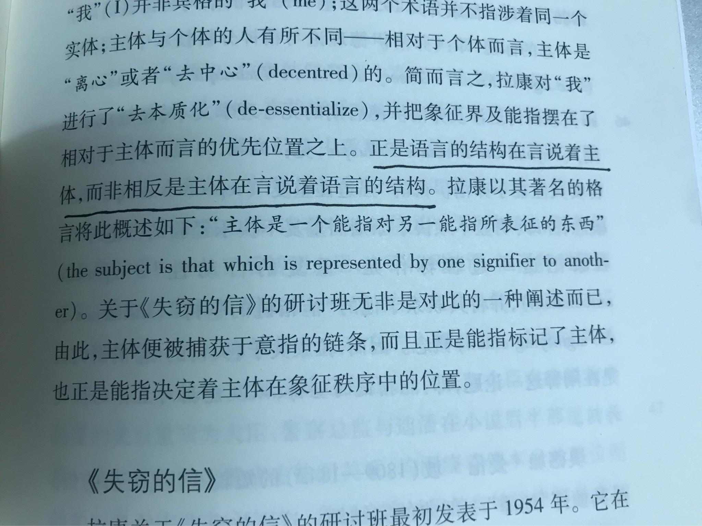
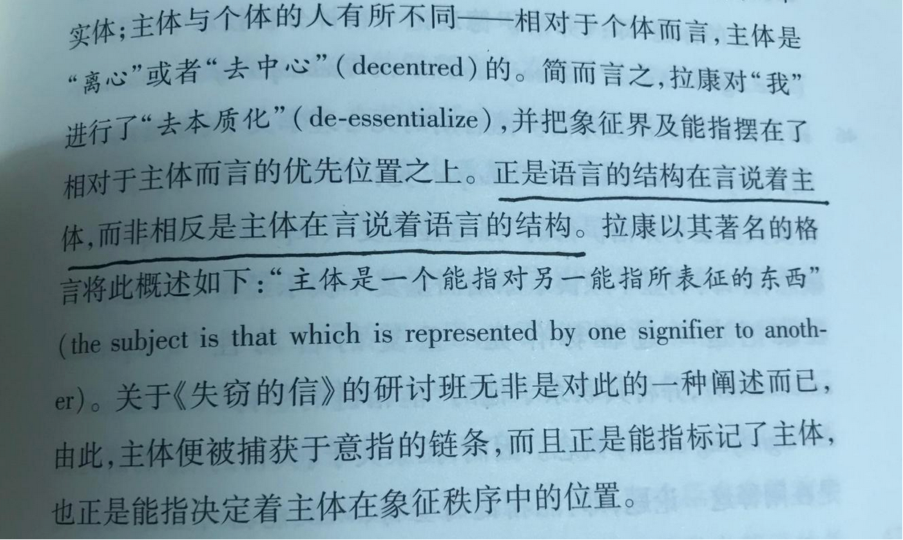
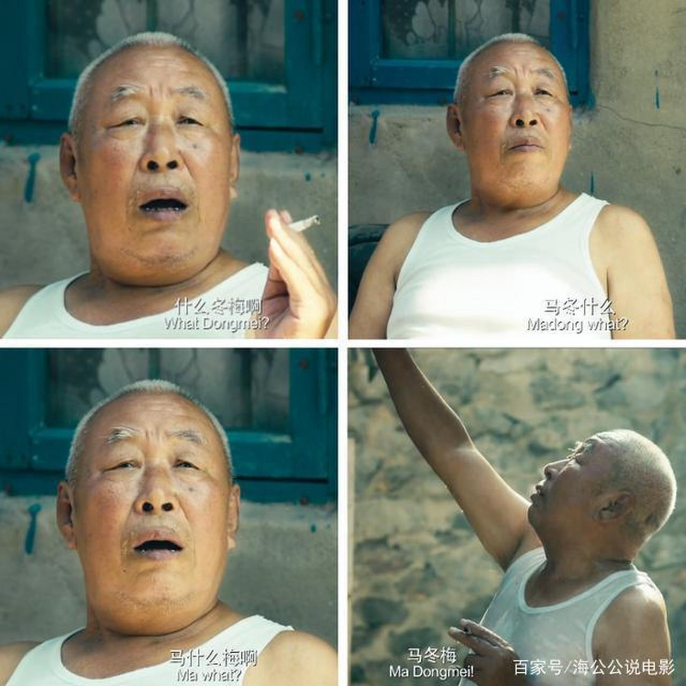
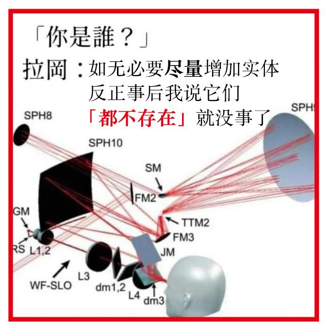
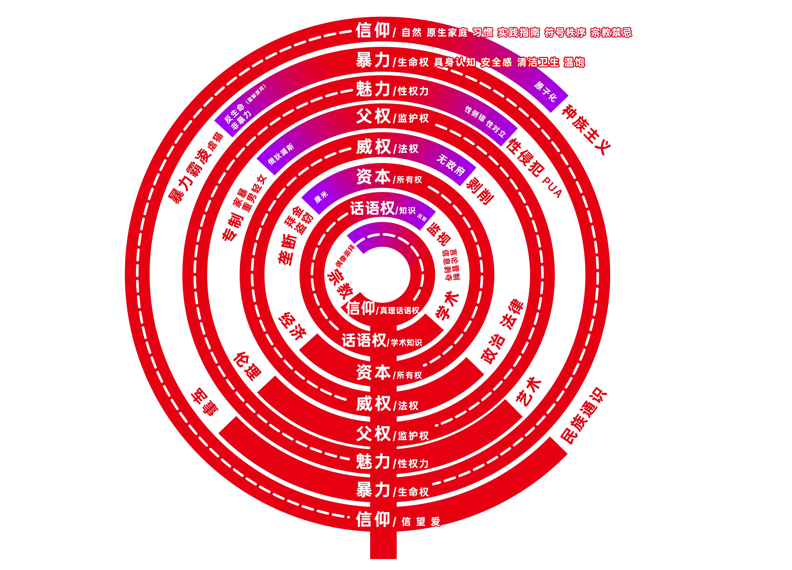

[toc]

# 问题

提问者：**<a href="https://www.zhihu.com/people/jian-ji-57-95">江富川</a>**
提问时间: 2021-9-2 19:9:43

阿里嘎多

# 回答

回答者： **<a href="https://www.zhihu.com/people/sophie-60-2">秦风黄鸟 Sophie</a>**
回答时间: 2025-8-15 14:54:50
点赞总数: 15
评论总数: 0
收藏总数: 24
喜欢总数：2

拉康所做的就是试图把辩证法的普遍规律描述成主观精神的独占规律，然后把所有精神实体性寄托在不能承担这个责任的主观精神中 _（自然科学自然是被割裂的）_ 。

> 「主体是一个能指对另一个能指所表征的东西」

在每个权力维度，权力的机制都是本体通过将自己能动的需求设定为权力载体的一种匮乏，从而搭建权力结构的，这根本就上升不到「主体」，实际上在这里，拉康非反思地把权力载体无差别地「拟人化」了。

一只雄性苍蝇，将雌性苍蝇作为自己的欲望对象，从而把自己的能动的性欲表现为一种对异性苍蝇的匮乏，这是最基本的生命权维度的权力结构，在拉康这里，雄性苍蝇就成了「主体」了，这就让他的理论变得很滑稽。

诚然，在知识话语权维度，话语权载体，也就是康德意义上的主体，是通过认识自己的「意向性」来把握自身的，「意向性」如胡塞尔所言总是指向外部对象，所以在不断指向的过程中将自身理解为一种对外部对象的匮乏以至虚无——到这里拉康并没有说错，但实际上已经不是什么新东西了，问题就在于这并不是主观精神阶段才有的辩证结构。

在黑格尔的「存在论」里，本体权力就将存在设定为一种对规定性的匮乏，从而让存在转变为「非存在」，这种向非存在的转变表面上看是一种否定性的活动，但是本质上是一种能动的建构过程——存在与非存在之间的张力是为了给「定在」预备场地，这不仅贯穿了哲学史，其源头甚至可以追溯到最经典的宗教神学文本。

>  _我若去为你们预备地方，就必再来接你们到我那里去，好使我在哪里，你们也在哪里。—— (约 14:3 )_ 

就拿上面的苍蝇为例，雄性苍蝇对雌性苍蝇的需求就是为了搭建苍蝇这个物种的「生命权实体性」，更好地实现生命「自洽」的目标 _**（这也是性别被演化出来的原因，性别不是为了让你们用来对立的）**_ ，而不是真的存在某种对雌性的形而上的需要，所以拉康所谓的「离心」或「去中心」恰恰是「自身归复」，通过积极的对需要和匮乏的建构，回到自身——也就是黑格尔说的本体回复自身的过程。

我在很多回答里都批判了这种截取黑格尔辩证法，然后用一种智者诡辩论的方式将其指向一种虚无主义的做法，这里拉康的做法也不例外。

[拉康学派的精神分析](https://zhuanlan.zhihu.com/p/719068226)

如果设置匮乏是仅在主观精神环节出现的机制，那么拉康就是对的，问题就在于，这本来就是辩证法从存在论经本质论、实体、概念论到精神哲学贯彻始终的核心，你说这是「去中心」「去本质」那不就是扯淡了吗？人家黑格尔就是拿这种反复重复出现的辩证结构来描述存在、本质、实体、概念.....精神这些绝对本质的，你还「无中心」无个头啊！——这就是中心！

> 绝对就是存在  
> 绝对就是本质  
> 绝对就是概念  
> 绝对就是推论  
> 绝对就是客体  
> 绝对就是理念  
> 绝对就是真理  
> ......  
> 逻辑理念的各阶段就是对绝对的界说  
> 绝对就是哲学的研究对象  
> ————黑格尔《小逻辑》

拉康的做法就像这个老头的行为：

马是马冬梅的马，冬是马冬梅的冬，梅是马冬梅的梅，你非要说来找一个不存在的人，找茬？

如下图，在每个权力维度，都重复着「设置匮乏，搭建结构」的过程，这种重复才是本体宣示自身的行动，而这才是黑格尔辩证逻辑建构的初衷：暴力→审美→父权→法权→产权→知识→信仰——知识话语权/哲学，在每个权力维度的演进中不断呼唤「本体」和「绝对」。

  

原文地址：[(秦风黄鸟 Sophie)如何理解「主体是一个能指对另一个能指所表征的东西」？](https://www.zhihu.com/question/484286402/answer/1939701561723950831) 

